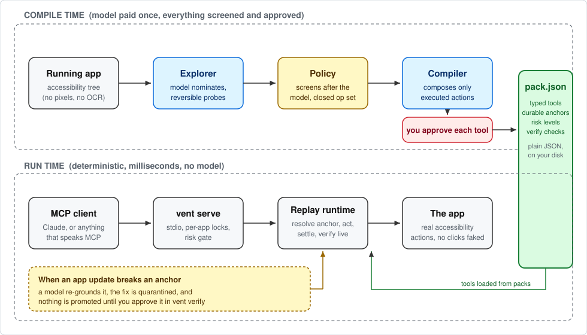

# Ventriloquist

Turn a Mac app into an MCP server using the accessibility API. An agent
explores the app once, the interesting actions get compiled into a JSON
"pack" of typed tools, and after that each tool call is deterministic
replay. No model runs per UI step and none runs on the serving path. The
client composing tool calls is still a model, so a multi-step workflow
has one model in it, but it's deciding which tools to call, not where to
click. No screenshots and no pixel coordinates anywhere in the codebase.

The idea is that most computer-use agents are interpreters. A model looks
at your screen and decides every single click, every time, which is slow
and expensive and breaks in weird ways. This is the compiler version of
that. You pay the model cost once during exploration, get back tools like
`write_document(text)`, and calling them later takes milliseconds. When an
app update breaks a recorded action, a model is brought back in to fix it,
but the fix sits in quarantine until you approve it.

The accessibility layer has been in every Mac app for decades because
screen readers depend on it. It turns out it's also a pretty good API for
driving apps, if you're careful about how you find elements again later.

## How it works



The top half runs once per app and is where the model earns its keep,
with a policy screening every probe and a human approving every tool.
The bottom half is what you actually use day to day, and it has no model
in it at all. The pack file in the middle is the whole interface between
the two: plain JSON you can read, diff, and check into a repo.

## Status

The whole loop works and has been run live: exploration under the safety
policy, compilation with a human approval step, deterministic replay over
MCP, and the full healing cycle (break an anchor, re-ground it, promote
the fix through `vent verify`). 91 offline tests run in CI on Linux and
macOS. Two packs ship in the repo: TextEdit, and VS Code, which matters
because VS Code is Electron and Electron accessibility is where most of
the hard-won fixes in this codebase came from.

Model calls work with an `ANTHROPIC_API_KEY`, or with no key at all if
you have the Claude Code CLI installed and signed in.

## Quick start

Needs macOS and Python 3.11+.

```bash
git clone https://github.com/ShaanGS/ventriloquist && cd ventriloquist
python3 -m venv .venv && .venv/bin/pip install -e .

.venv/bin/vent doctor            # check Accessibility permission
.venv/bin/vent apps              # list running apps
.venv/bin/vent inspect Notes     # semantic snapshot of a live app
```

`vent` needs Accessibility permission for whatever runs it. System
Settings > Privacy & Security > Accessibility, then enable your terminal.

## Try the shipped TextEdit pack

The example pack was recorded against a document window, so give it one:

```bash
echo "hello" > /tmp/vent-demo.txt && open -a TextEdit /tmp/vent-demo.txt

.venv/bin/vent run TextEdit write_document --arg text="typed by a pack"
.venv/bin/vent run TextEdit read_document
```

Anchors are recorded per machine and per app version, so the shipped packs
are examples of the format more than guarantees for your exact setup. If a
tool refuses to resolve, that's the safety design doing its job (it never
guesses between lookalike elements), and re-recording takes about a minute
with `vent inspect` and `vent anchor`. See section 5 of
[docs/ARCHITECTURE.md](docs/ARCHITECTURE.md).

## Wire it into an MCP client

`vent serve` speaks MCP over stdio. For Claude Code:

```bash
claude mcp add ventriloquist -- /FULL/PATH/TO/ventriloquist/.venv/bin/vent serve
```

For Claude Desktop, add to `claude_desktop_config.json`:

```json
{
  "mcpServers": {
    "ventriloquist": {
      "command": "/FULL/PATH/TO/ventriloquist/.venv/bin/vent",
      "args": ["serve"]
    }
  }
}
```

Tools show up as `textedit_write_document` and so on. Anything marked
`risk: high` in a pack is refused unless the server was started with
`VENT_ALLOW_HIGH=1`. [docs/SECURITY.md](docs/SECURITY.md) explains why.

## Anchor durability, measured

`vent harness <app>` records anchors for an app's elements, messes with
the app (a real window resize, and optionally a full quit and relaunch),
and then tries to resolve every anchor again. Survival only counts when
the element found is provably the one that was recorded. Binding a
lookalike counts as WRONG, which is the number that actually matters.

Numbers from this machine (macOS 26, small anchor sets, early days):

```
TextEdit: baseline 100%,  resized 100%,   0 wrong
Finder:   baseline 100%,  resized 100%,   0 wrong
VS Code:  baseline  95%,  resized  87.5%, restart 92.5%, 0 wrong  (40 anchors)
Slack:    baseline  95%,  resized  82.5%, restart 82.5%, 0 wrong  (40 anchors)
```

Slack matters here more than the others. TextEdit and Finder have
AppleScript, VS Code has a CLI and an extension API, so the apps that
justify this project are the ones with no scripting surface at all, and
Slack is the first of those measured. Its tree has no identifiers
anywhere, so anchors ride entirely on labels and ancestor chains, and
they still come back with zero wrong bindings across resize and a full
restart. Every non-survivor is an ambiguity refusal.

Figma desktop is the deliberate worst case and it behaves like one: the
app shell (tabs, navigation, buttons) publishes a usable tree, and the
design canvas publishes nothing, because it's rendered pixels. That's
the honest boundary of the accessibility thesis. Apps whose content is
a custom-drawn canvas keep their chrome scriptable and their content
opaque.

The VS Code restart round quits and relaunches the app completely, and 37
of 40 anchors still bind to provably the same element afterward. The ones
that don't survive are refusals, not mistakes: Chromium trees are full of
unlabeled twin groups, and when two candidates score too close together
the resolver refuses to pick one. The VS Code pack's own curated anchors
went 6 for 6 across view switches, a resize, and an actual app update.

Per-anchor survival flatters what a caller actually experiences, because
a tool touches several anchors plus settling and verification, so there
is a second harness mode that runs whole tools end to end.
`vent harness <app> --tools` executes every tool in the app's pack
repeatedly, resizing the window every other cycle:

```
TextEdit: 8/8 calls passed   (4 cycles)
VS Code:  12/16 calls passed (4 cycles, every failure the same tool)
```

The VS Code failures are all `search_workspace` called cold. Its
description says to open the Search view first, but that dependency is
prose, not a machine-checked precondition, so a caller who ignores it
fails and so does this harness, on purpose. The anchors were fine in
every failing call. That gap between 87.5% per-anchor and 75% per-tool
is the honest cost of state in a GUI, and stateful preconditions are the
planned fix.

One thing to know for VS Code specifically: launch it with
`--force-renderer-accessibility`. Without that flag the tree can still be
read, but actions get silently ignored, which looks healthy right up until
a press does nothing.

Some field notes that ended up shaping the code: macOS AX trees can be
cyclic (a wedged TextEdit once returned the app element as its own child,
so every walk carries a cycle guard), apps relaunched from a background
process serve junk menubar-only trees until they're genuinely foregrounded,
a pending permission dialog silently degrades AX for every app launched
after it, and a locked screen makes every app read as empty while the
permission check still passes.

## Design

Read [docs/ARCHITECTURE.md](docs/ARCHITECTURE.md) before the code, and
[docs/SECURITY.md](docs/SECURITY.md) for the threat model. Both went
through adversarial review before implementation and got rewritten from
the findings, and each phase since has gotten the same treatment.

## The full workflow

```bash
vent doctor Spotify                 # does this app expose a usable tree?
vent explore Notes --no-values      # model probes safely, policy screens, trace recorded
vent compile Notes                  # model proposes tools; you approve against literal steps
vent serve                          # every approved pack becomes MCP tools
vent run Notes create_note --arg body="..."   # or call one tool directly
vent verify Notes                   # dry-resolve anchors; promote quarantined heals
```

Only `vent explore` and `vent run --heal` talk to a model. Everything
else, including serving compiled packs, runs offline.
